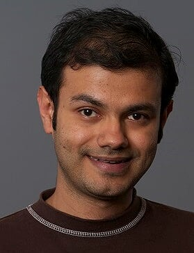

[[Home]](index.html) | [[Publications]](publications.html) | [[Patents]](patents.html) | [[Service]](service.html) | [[Awards]](awards.html)

# Bio
Sudipto Das is a Senior Principal Engineer at [Amazon Web Services (AWS)](https://aws.amazon.com/). He leads the technical architecture and strategy of AWS Analytics services with special focus as the Uber Tech Lead on [Amazon Redshift](https://aws.amazon.com/redshift/). He was also one of the founding architects and engineers in [Amazon Timestream](https://aws.amazon.com/timestream/) a fast, scalable, fully-managed, serverless time series database offering in the AWS Database Services umbrella.

Sudipto is an engineering and research leader known for his work on scalable database management systems for cloud platforms. His expertise spans the broad areas of distributed query processing, efficient resource management for cloud database infrastructures, automated tuning (in particular automated indexing) of relational database-as-a-service, performance isolation, and scale-out transaction processing systems leveraging modern hardware paradigms.

At AWS, Sudipto was one of the architects and engineers building out [Timestream which was designed from the ground up](https://www.allthingsdistributed.com/2021/06/amazon-timestream-time-series-is-the-new-black.html) as a scalable time series database that supports high throughput streaming data ingestion and concurrent real-time querying with the full SQL surface area in a fully managed serverless offering. In addition to engineering and architecture, he also shaped the product offering, its roadmap, and innovations on the customer's behalf working closely with hundreds of customers.

Prior to AWS, Sudipto was a Senior Researcher the [Data Management, Exploration, and Mining (DMX)](https://www.microsoft.com/en-us/research/group/data-management-exploration-and-mining-dmx/) group at [Microsoft Research (MSR)](https://www.microsoft.com/en-us/research/). At MSR, his research has shaped several key features and business offerings in [Microsoft’s Azure SQL Database](https://azure.microsoft.com/en-us/services/sql-database/) platform. His work in the [SQLVM](https://www.microsoft.com/en-us/research/project/sqlvm-performance-isolation-in-multi-tenant-relational-database-as-a-service/) project formed the basis of CPU performance isolation capabilities, which was exposed as the new [Service Tiers and Performance Levels](http://msdn.microsoft.com/en-us/library/azure/dn741336.aspx), made generally available in September 2014 for Azure SQL Database, and new resource governance functionality in SQL Server 2016. His work also significantly improved efficiency of Azure DB’s infrastructure with new node-local and cluster-wide resource management mechanisms and policies. He also led the project on automated indexing which significantly enhanced the ability to automatically recommend a variety of index structures (shipped with [Database Tuning Advisor](https://docs.microsoft.com/en-us/sql/relational-databases/performance/columnstore-index-recommendations-in-database-engine-tuning-advisor-dta?view=sql-server-2017) along with [SQL Server 2017](https://docs.microsoft.com/en-us/sql/database-engine/whats-new-in-sql-server-2017?view=sql-server-2017)) and significant enhancements to index recommendations in the [Auto-indexing offering](https://azure.microsoft.com/en-us/blog/artificial-intelligence-tunes-azure-sql-databases/) in Azure SQL Database.

Sudipto holds a PhD in Computer Science from [University of California, Santa Barbara](https://cs.ucsb.edu/). His [PhD thesis](https://dl.acm.org/citation.cfm?id=2521552) research on developing scalable, elastic, and autonomic transaction processing  systems  to  support  cloud  application  platforms  won  several  awards  including  the  [ACM SIGMOD Jim Gray Dissertation Award](http://sigmod.org/sigmod-awards/citations/2013-sigmod-jim-gray-doctoral-dissertation-award/) (the highest award given to a PhD dissertation in the database area) and the [UC Santa Barbara Graduate division’s Lancaster Award](https://cs.ucsb.edu/news/1179) (given to one PhD dissertation in the class  of PhDs in the  areas of Engineering, Mathematics,  and Sciences  at UC Santa  Barbara). He has published more than twenty papers at top-tier database conferences which have been cited more than 3500 times and is the recipient of a Best Paper and a Best Paper Runner-up award.

Sudipto is well-known for his expertise in database systems. He regularly serves on the program committees of top-tier database conferences, is an Associate Editor for the Journal on Distributed and Parallel  Databases,  and  has  delivered  invited  lectures  and  Keynotes  at  database  conferences.  His research has also resulted in several patents granted and currently in review.

Sudipto is originally from the “City of Joy” Kolkata in India. His undergraduate study was in Jadavpur University, Kolkata where he completed my Bachelor of Engineering from the Department of Computer Science and Engineering.

# Additional Links
- [Twitter](https://twitter.com/sudiptdas?lang=en)
- [LinkedIn](https://www.linkedin.com/in/sudiptodas/)
- [Google Scholar](https://scholar.google.com/citations?user=LKgo-jcAAAAJ&hl=en)
- [DBLP](https://dblp.uni-trier.de/pers/hd/d/Das:Sudipto)
